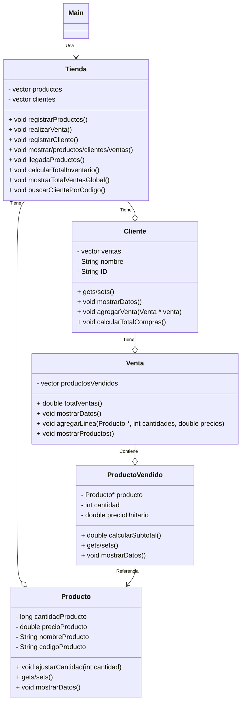

```mermaid

classDiagram
   class Tienda{
    - vector productos
    - vector clientes 
    + void registrarProductos()
    + void realizarVenta( )
    + void registrarCliente()
    + void mostrar/productos/clientes/ventas()
    + void llegadaProductos( )
    + void calcularTotalInventario()
    + void mostrarTotalVentasGlobal()
    + void buscarClientePorCodigo()

   }

    class Producto{
        - long cantidadProducto
        - double precioProducto
        - String nombreProducto
        - String codigoProducto
        + void ajustarCantidad( int cantidad) 
        + gets/sets()
        + void mostrarDatos()
    }

    class ProductoVendido{
        - Producto* producto
        - int cantidad
        - double precioUnitario
        + double calcularSubtotal()
        + gets/sets()
        + void mostrarDatos()
    }

    class Venta {
        - vector productosVendidos
       
        + double totalVentas()
        + void mostrarDatos()
        + void agregarLinea( Producto *, int cantidades, double precios)
        + void mostrarProductos()
    }

    class Cliente{
        - vector ventas
        - String nombre
        - String ID
        
        + gets/sets()
        + void mostrarDatos()
        + void agregarVenta( Venta * venta)
        + void calcularTotalCompras()

    }

    class Main{

    }

     Main "Usa "..> Tienda
     
     Tienda "Tiene" --o Cliente
     Tienda "Tiene" --o Producto
     Cliente "Tiene" --o Venta
     Venta "Contiene" --o ProductoVendido
     ProductoVendido "Referencia" --> Producto

```